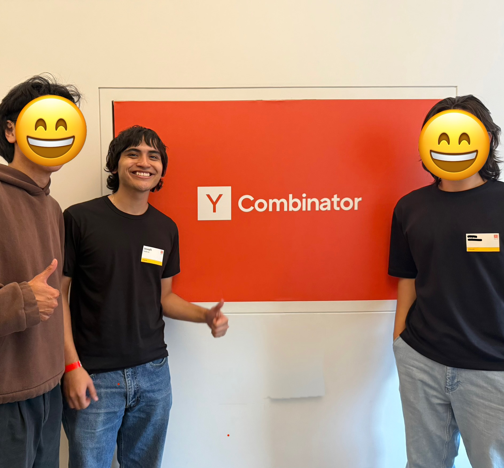

# Hey, I am Joseph 👋

I am a software engineer and UC Berkeley Data Science grad. I spend most of my time building full stack and AI projects. I’ve been working as a software developer testing and evaluating beta versions of major coding models, and now I’m looking to join a startup or similar company where I can grow my skills faster and put my entrepreneurial mindset to work.

- 📍 San Francisco Bay Area  
- 🎓 UC Berkeley Data Science, Class of 2025  
- 🤖 Proficient and up to date with all major AI coding tools and frameworks (Codex, Claude, Cursor, Gemini, etc.)
- ⚡ Will learn anything quickly
  

  

### Why Me
- Comfortable living inside modern AI dev tools and I'll evolve with the tech (every other week nowadays)
- Recently pitched my own idea at a Y Combinator hackathon to YC investors, and I am just getting started.
- I've shipped fullstack products that live and work in the cloud, not just school projects
- First gen with no tech connections and worked my way to a UC Berkeley degree, so grit is not a question

Below are some of the things I'm most familiar with but I'm confident I can pick up anything you need me to
### Tech Stack

**Languages:** `Python` `TypeScript` `JavaScript` `SQL` `Java`
**Frontend:** `React` `Next.js` `Expo` `React Native` `Tailwind` `shadcn/ui`  
**Backend and data:** `Node` `PostgreSQL` `Supabase` `pgvector` 
**Cloud and DevOps:** `AWS` `Vercel` `Docker` `Pulumi`  
**Observability:** `OpenTelemetry` `Prometheus` `Grafana`

### Contact

- ✉️ `josepha@berkeley.edu` or `josephsaldivarg@gmail.com`  
- 💼 [LinkedIn](https://www.linkedin.com/in/josephasaldivar/)
